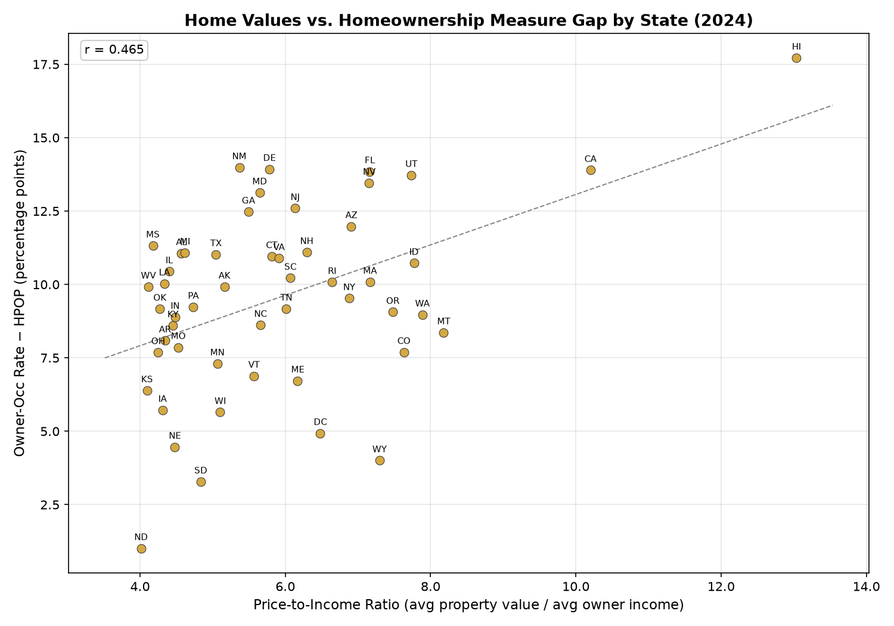

# HPOP — Homeowners-to-Population Ratio

Replicates the Minneapolis Fed's HPOP measure using 2024 ACS PUMS microdata.

**HPOP** = share of adults (18+) who own their home  
**Owner-Occ** = share of occupied housing units that are owner-occupied  
**Gap** = Owner-Occ − HPOP (percentage points)

## Setup

```bash
uv sync
```

## Download Data

```bash
uv run python scripts/download_data.py
```

Fetches 2024 ACS 1-Year PUMS person and housing files (~4 GB total) and Minneapolis Fed HPOP data into `data/2024/`.

## Run

```bash
uv run python scripts/hpop_state_2024.py   # compute metrics by state
uv run python scripts/plot_gap.py          # generate plot
uv run python scripts/results_to_md.py     # generate results markdown
```

## Output

- `output/hpop_by_state_2024.csv` — per-state metrics (HPOP, owner-occ, gap, rent-to-income, housing form shares)
- `output/gap_vs_rent_to_income.png` — scatter plot of gap vs rent burden
- `output/results.md` — full results tables and validation

## Results

### National Summary

| Metric | Value |
|--------|-------|
| HPOP | 57.5% |
| Owner-Occupancy Rate | 67.1% |
| Gap (Owner-Occ − HPOP) | -9.5 pp |
| Rent-to-Income Ratio | 0.457 |

### Validation vs Minneapolis Fed

| Metric | Correlation (r) | MAE (pp) | Mean Bias |
|--------|-----------------|----------|-----------|
| HPOP | 0.9972 | 1.60 | +1.60 |
| Owner-Occ | 1.0000 | 0.03 | -0.01 |

Our HPOP runs ~1.6 pp high across all states. Owner-occ matches nearly perfectly.
The HPOP offset is likely from different handling of group quarters or relationship coding.

### Key Findings




1. **HPOP < Owner-Occ everywhere** — traditional owner-occupancy rate always overstates
   effective homeownership because it counts cohabitants (adult children, roommates)
   in owner-occupied units as owners.

2. **Gap varies by state** — ranges from -1.0 pp (ND) to -17.7 pp (HI), driven by
   housing costs, household composition, and prevalence of adult co-residents.

3. **Rent burden correlates more strongly** with the gap (r = -0.82) than owner price-to-income (r = -0.47), suggesting that renter housing costs are a better proxy for the affordability pressure that drives co-residence.

See `output/results.md` for full state-level tables.
