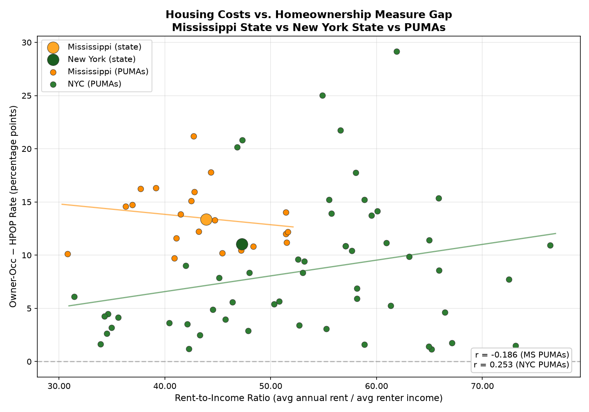
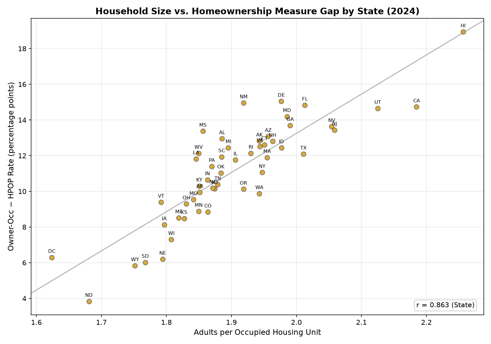
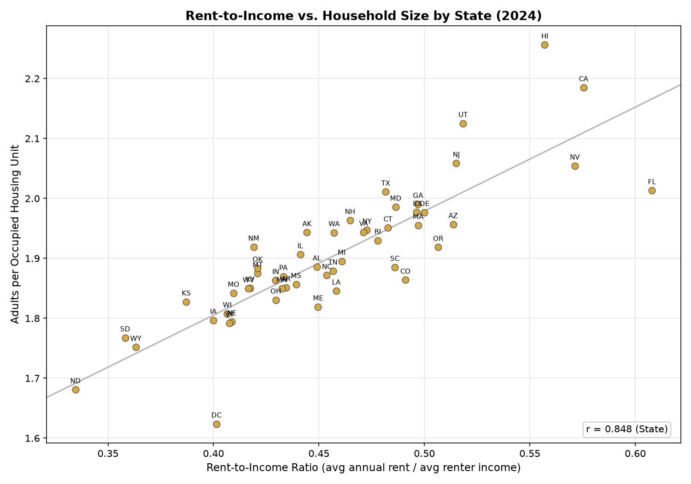

# HPOP: Homeowners-to-Population Ratio

Replicates the Minneapolis Fed's HPOP measure using 2024 ACS PUMS microdata, then zooms into Mississippi and NYC at the PUMA level to understand what drives the gap between the two homeownership measures.

**HPOP** = share of adults (18+) who own their home  
**Owner-Occ** = share of occupied housing units that are owner-occupied  
**Gap** = Owner-Occ \u2212 HPOP (percentage points)

## Setup

```bash
uv sync
```

## Download Data

```bash
uv run python scripts/download_data.py
```

Fetches 2024 ACS 1-Year PUMS person and housing files (~4 GB total) and Minneapolis Fed HPOP data into `data/2024/`.

## Run

```bash
uv run python main.py   # full pipeline
```

Or run individual steps:

```bash
uv run python scripts/hpop_state_2024.py              # compute metrics by state
uv run python scripts/plot_gap.py                      # generate state-level plots
uv run python scripts/results_to_md.py                 # generate state results markdown
uv run python scripts/puma_ms_all/puma_analysis.py     # compute MS + NYC PUMA metrics
uv run python scripts/puma_ms_all/plot_compare.py      # generate PUMA comparison plots
uv run python scripts/puma_ms_all/puma_results_to_md.py # generate PUMA results markdown
```

## Output

- `output/hpop_by_state_2024.csv`: per-state metrics
- `output/gap_vs_rent_to_income.png`: rent-to-income vs gap
- `output/owner_occ_vs_multifamily.png`: multifamily share vs occupancy rate
- `output/gap_vs_adults_per_unit.png`: adults per home vs gap
- `output/adults_per_unit_vs_rent_to_income.png`: rent-to-income vs adults per home
- `output/results.md`: state-level results and validation
- `output/puma/ms_puma_metrics.csv`: Mississippi PUMA-level metrics (21 PUMAs)
- `output/puma/nyc_puma_metrics.csv`: NYC PUMA-level metrics (55 PUMAs)
- `output/puma/puma_rent_to_income_vs_gap.png`: PUMA rent-to-income vs gap
- `output/puma/puma_owner_occ_vs_multifamily.png`: PUMA multifamily share vs occupancy rate
- `output/puma/puma_gap_vs_adults_per_unit.png`: PUMA adults per home vs gap
- `output/puma/puma_adults_per_unit_vs_rent_to_income.png`: PUMA rent-to-income vs adults per home
- `output/puma/puma_results.md`: PUMA-level results and analysis

## Results

## Validation vs Minneapolis Fed

| Metric | Correlation (r) | MAE (pp) | Mean Bias |
|--------|-----------------|----------|-----------|
| HPOP | 1.0000 | 0.03 | -0.01 |
| Owner-Occ | 1.0000 | 0.03 | -0.01 |








See `output/results.md` for state-level tables and `output/puma/puma_results.md` for PUMA-level tables.
