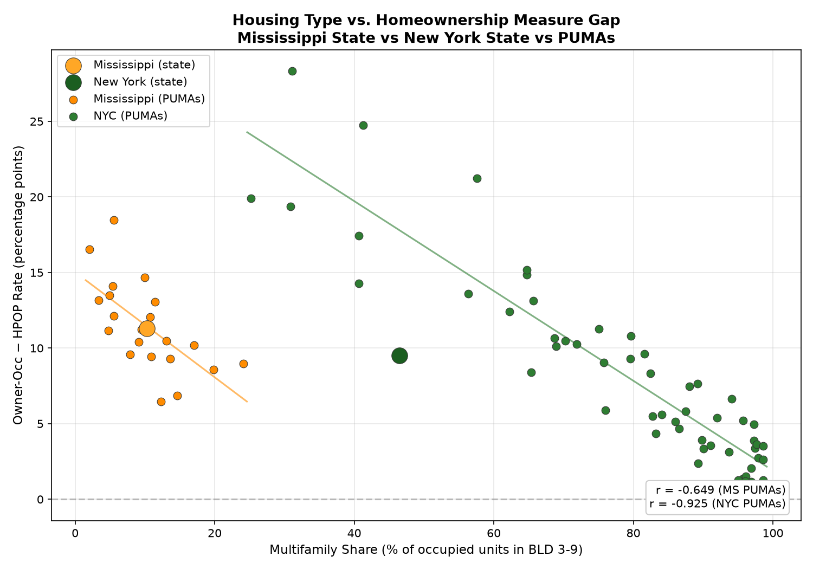
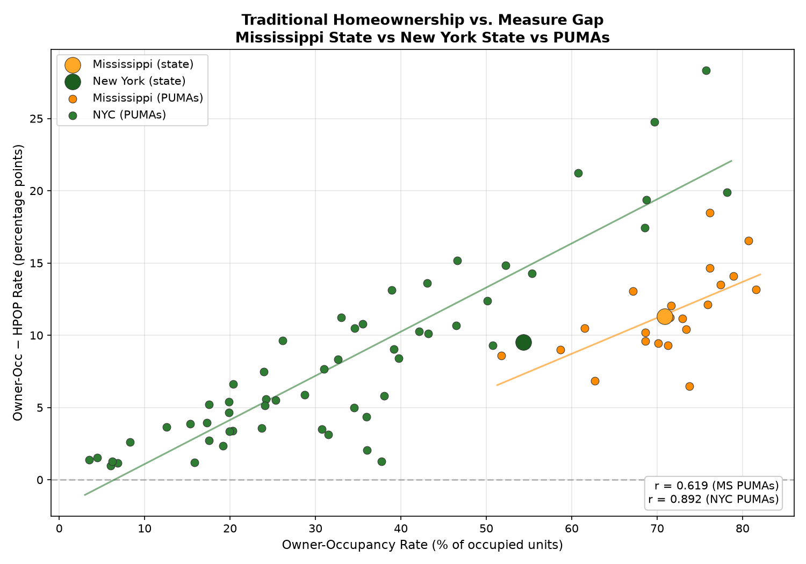

# HPOP: Homeowners-to-Population Ratio

Replicates the Minneapolis Fed's HPOP measure using 2024 ACS PUMS microdata, then zooms into Mississippi and NYC at the PUMA level to understand what drives the gap between the two homeownership measures.

**HPOP** = share of adults (18+) who own their home  
**Owner-Occ** = share of occupied housing units that are owner-occupied  
**Gap** = Owner-Occ − HPOP (percentage points)

## Setup

```bash
uv sync
```

## Download Data

```bash
uv run python scripts/download_data.py
```

Fetches 2024 ACS 1-Year PUMS person and housing files (~4 GB total) and Minneapolis Fed HPOP data into `data/2024/`.

## Run

```bash
uv run python main.py   # full pipeline
```

Or run individual steps:

```bash
uv run python scripts/hpop_state_2024.py              # compute metrics by state
uv run python scripts/plot_gap.py                      # generate state-level plots
uv run python scripts/results_to_md.py                 # generate state results markdown
uv run python scripts/puma_ms_all/puma_analysis.py     # compute MS + NYC PUMA metrics
uv run python scripts/puma_ms_all/plot_compare.py      # generate PUMA comparison plots
uv run python scripts/puma_ms_all/puma_results_to_md.py # generate PUMA results markdown
```

## Output

- `output/hpop_by_state_2024.csv`: per-state metrics
- `output/gap_vs_rent_to_income.png`: gap vs rent burden
- `output/gap_vs_price_to_income.png`: gap vs price-to-income
- `output/gap_vs_owner_occ.png`: gap vs traditional homeownership rate
- `output/state_multifamily_vs_gap.png`: state-level multifamily share vs gap
- `output/owner_occ_vs_multifamily.png`: homeownership rate vs multifamily share
- `output/results.md`: state-level results and validation
- `output/puma/ms_puma_metrics.csv`: Mississippi PUMA-level metrics (21 PUMAs)
- `output/puma/nyc_puma_metrics.csv`: NYC PUMA-level metrics (55 PUMAs)
- `output/puma/compare_multifamily_vs_gap.png`: multifamily share vs gap
- `output/puma/puma_rent_to_income_vs_gap.png`: PUMA rent-to-income vs gap
- `output/puma/puma_gap_vs_owner_occ.png`: PUMA gap vs traditional homeownership rate
- `output/puma/puma_owner_occ_vs_multifamily.png`: PUMA homeownership rate vs multifamily share
- `output/state_multifamily_vs_gap.png`: state-level multifamily vs gap
- `output/puma/puma_results.md`: PUMA-level results and analysis

## Results

### 1. State-Level: The Minneapolis Fed Replication

Across 51 states, the gap between Owner-Occ and HPOP correlates strongly with rent burden (r = -0.82). States where rent consumes a larger share of income have smaller gaps: meaning HPOP and Owner-Occ converge because more adults live in owner-occupied units without being owners themselves.


### 2. PUMA-Level: The Ecological Correlation Breakdown

At the PUMA (neighborhood) level within Mississippi and NYC, the rent-to-income correlation collapses. This is a classic ecological fallacy: the state-level relationship is driven by between-state variation, not within-state neighborhood dynamics.


### 3. PUMA-Level: Multifamily Housing is the Real Driver

At the neighborhood level, the gap is strongly predicted by the share of multifamily housing. In both Mississippi (r = -0.649) and NYC (r = -0.925), neighborhoods with more multifamily units have smaller gaps.





| Variable | MS PUMAs (r) | NYC PUMAs (r) |
|----------|--------------|---------------|
| Multifamily Share | -0.649 | -0.925 |
| Rent-to-Income 18+ | -0.02 | 0.27 |
| Owner-Occ Rate | 0.619 | 0.892 |

The gap also tracks the traditional owner-occupancy rate at the neighborhood level: areas with lower owner-occupancy (denser, more multifamily) have smaller gaps.

### 4. Interpretation

In places with more multifamily housing, the gap is smaller: Owner-Occ and HPOP are closer together. This means more multifamily housing makes it easier for people to form independent households.

The policy implication is **building more multifamily housing helps people form independent households**, even though building more multifamily housing likely lowers the overall owner-occupancy rate and HPOP. The wrong conclusion would be to focus on raising ownership rates by subsidizing ownership or building more low-density housing.

The owner-occ vs gap plot drives this tension home: you cannot simultaneously maximize both. The positive correlation (MS r = 0.619, NYC r = 0.892) means high owner-occupancy neighborhoods have the largest gaps: lots of cohabitation, fewer independent households. Low owner-occupancy neighborhoods have the smallest gaps: more people living on their own, even if they rent. The tradeoff is structural: dense multifamily housing creates more housing units per area, enabling independence, but it mechanically lowers the share of units that are owner-occupied.

## Validation vs Minneapolis Fed

| Metric | Correlation (r) | MAE (pp) | Mean Bias |
|--------|-----------------|----------|-----------|
| HPOP | 0.9972 | 1.60 | +1.60 |
| Owner-Occ | 1.0000 | 0.03 | -0.01 |

The near-perfect correlation (r = 0.997) confirms my HPOP measure tracks the Minneapolis Fed's almost exactly. The +1.60 pp mean bias suggests a small, systematic offset: likely from a difference in how we define the adult universe (e.g., 18+ vs 15+ or institutionalized population handling).

## Key Findings

1. **HPOP < Owner-Occ everywhere**: traditional owner-occupancy rate always overstates effective homeownership because it counts cohabitants (adult children, roommates) in owner-occupied units as owners.

2. **Gap varies by state**: ranges from -1.0 pp (ND) to -17.7 pp (HI), driven by housing costs, household composition, and prevalence of adult co-residents.

3. **Rent burden is a between-state phenomenon**: strong at state level (r = -0.82) but weak within metros, meaning affordability pressure varies more across regions than across neighborhoods.

4. **Higher multifamily share predicts a smaller gap at every scale**: it's the consistent driver at the neighborhood level.

5. **Independence and homeownership are in tension**: the gap and owner-occupancy are strongly correlated (MS r = 0.619, NYC r = 0.892), meaning the neighborhoods that maximize independence (smallest gaps, people living on their own) are the ones with the lowest homeownership rates. You cannot maximize both at once. 

Bottom line: Preventing multifamily housing in an attempt to increase homeownership rates is likely to reduce independent household formation (i.e. increase the gap between owner-occupancy and HPOP).

See `output/results.md` for state-level tables and `output/puma/puma_results.md` for PUMA-level tables.
