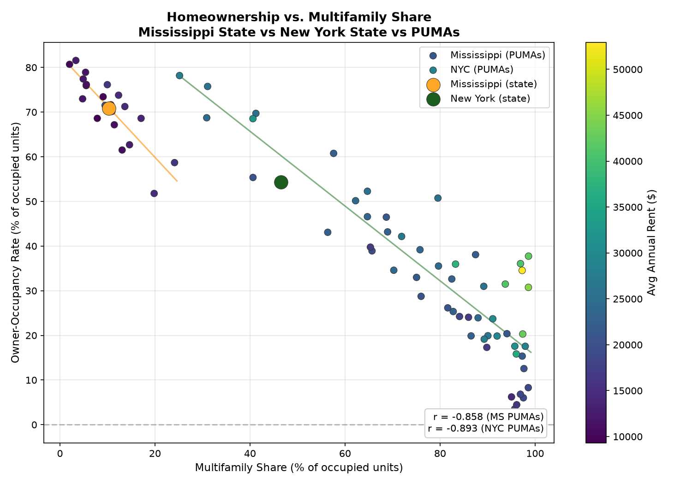
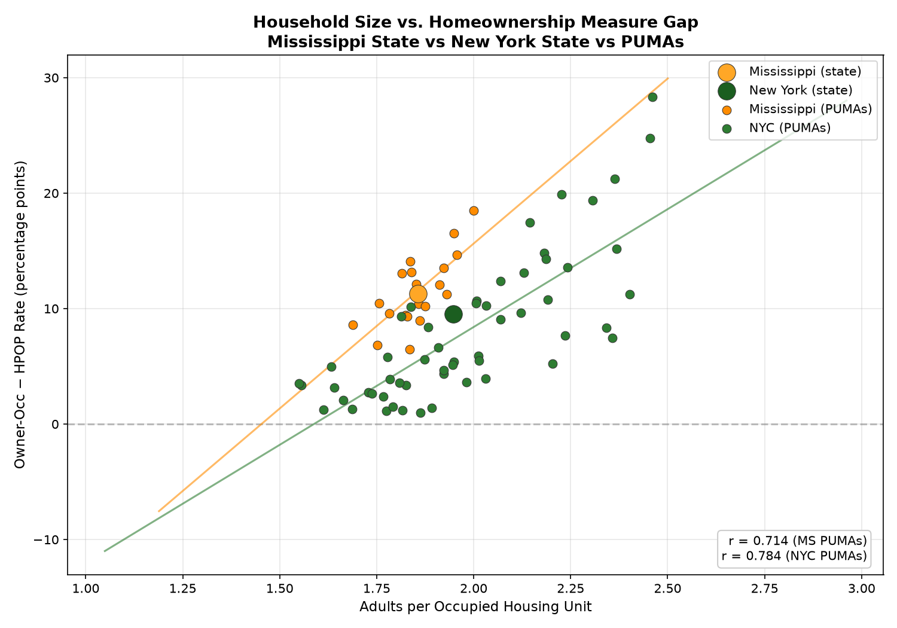
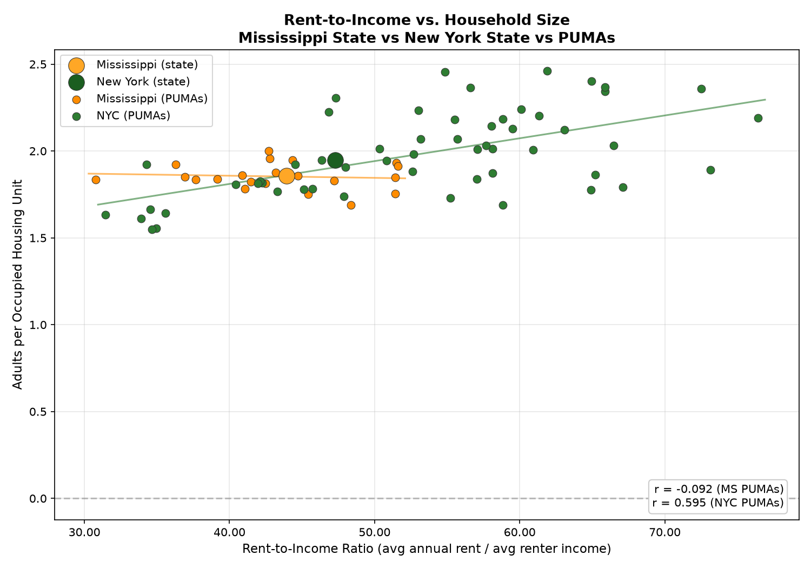

# PUMA-Level HPOP Analysis — Mississippi vs NYC

## Summary Statistics

| Metric | Mississippi (PUMAs) | NYC (PUMAs) | Mississippi (state) | New York (state) |
|--------|-------------------|-------------|--------------------|-----------------|
| Count | 21 PUMAs | 55 PUMAs | 1 state | 1 state |
| Mean HPOP | 59.5% | 24.8% | 59.5% | 44.8% |
| Mean Owner-Occ | 71.0% | 32.9% | 70.9% | 54.3% |
| Mean Gap (Owner-Occ − HPOP) | -11.4 pp | -8.1 pp | -11.3 pp | -9.5 pp |
| Mean Multifamily | 10.3% | 79.2% | 10.3% | 46.5% |
| Mean Rent-to-Income | 43.4% | 53.2% | — | — |
| Mean Adult Income | $42,884 | $62,553 | $43,278 | $64,939 |

## Correlations vs Gap (neg_gap)

| Variable | MS PUMAs (r) | NYC PUMAs (r) |
|----------|--------------|---------------|
| Multifamily Share | -0.649 | -0.925 |
| Rent-to-Income | -0.022 | 0.266 |
| Adults per Unit | 0.714 | 0.784 |

## Mississippi PUMA Details

| PUMA | Name | HPOP | Owner-Occ | Gap | Multifamily | Rent/Inc |
|------|------|------|-----------|-----|-------------|----------|
| 1600 | Gulf Coast Region - Harrison & Hancock Counties | 57.7% | 76.2% | -18.5 | 5.5% | 42.7% |
| 1400 | Pine Belt Region | 64.1% | 80.7% | -16.5 | 2.0% | 44.3% |
| 1300 | Central Region - Rankin & Simpson Counties | 61.5% | 76.1% | -14.7 | 10.0% | 42.8% |
| 1001 | Central Region - Jackson City | 64.8% | 78.9% | -14.1 | 5.4% | 37.7% |
| 1900 | Southeast Pine Region | 63.9% | 77.4% | -13.5 | 4.9% | 36.3% |
| 1700 | Southwest Pine Region | 68.4% | 81.6% | -13.2 | 3.4% | 39.2% |
| 300 | North Central Region | 54.1% | 67.2% | -13.0 | 11.4% | 42.5% |
| 200 | Northeast Region | 63.8% | 75.9% | -12.1 | 5.5% | 36.9% |
| 2100 | Gulf Coast Region - Jackson County | 59.6% | 71.6% | -12.0 | 10.7% | 51.6% |
| 100 | North Region | 60.3% | 71.5% | -11.2 | 9.5% | 51.5% |
| 500 | East Central Region | 61.8% | 73.0% | -11.2 | 4.8% | 51.4% |
| 800 | Southwest Region | 51.0% | 61.5% | -10.5 | 13.1% | 51.4% |
| 1500 | Gulf Coast Region - Jackson County | 63.0% | 73.4% | -10.4 | 9.1% | 44.7% |
| 1800 | Southern Region | 58.4% | 68.6% | -10.2 | 17.1% | 43.2% |
| 700 | South Delta Region | 59.0% | 68.6% | -9.6 | 7.9% | 41.1% |
| 400 | Northeast Delta Region | 60.7% | 70.2% | -9.4 | 10.9% | 41.5% |
| 2001 | Gulf Coast Region - Harrison County West | 61.9% | 71.2% | -9.3 | 13.7% | 47.2% |
| 2002 | Gulf Coast Region - Harrison County East | 49.7% | 58.7% | -9.0 | 24.1% | 40.9% |
| 1101 | Central Region - Jackson (East & Central) | 43.2% | 51.8% | -8.6 | 19.8% | 48.4% |
| 600 | Central West Region | 55.8% | 62.7% | -6.8 | 14.6% | 45.4% |
| 900 | Central Region - Madison & Rankin Counties | 67.3% | 73.8% | -6.5 | 12.3% | 30.8% |

## NYC PUMA Details

| PUMA | Name | HPOP | Owner-Occ | Gap | Multifamily | Rent/Inc |
|------|------|------|-----------|-----|-------------|----------|
| 4413 | Howard Beach | 47.4% | 75.7% | -28.3 | 31.1% | 61.9% |
| 4410 | Kew Gardens | 45.0% | 69.7% | -24.7 | 41.2% | 54.9% |
| 4318 | Bergen Beach | 39.5% | 60.8% | -21.2 | 57.6% | 56.6% |
| 4503 | Tottenville | 58.3% | 78.2% | -19.9 | 25.2% | 46.9% |
| 4502 | New Dorp | 49.4% | 68.7% | -19.4 | 30.9% | 47.3% |
| 4411 | Woodhaven | 51.1% | 68.5% | -17.4 | 40.6% | 58.0% |
| 4409 | Rego Park | 31.4% | 46.6% | -15.2 | 64.7% | 65.9% |
| 4407 | Forest Hills | 37.4% | 52.3% | -14.8 | 64.7% | 55.5% |
| 4501 | St. George | 41.1% | 55.4% | -14.3 | 40.6% | 58.8% |
| 4412 | Jamaica | 29.5% | 43.1% | -13.6 | 56.4% | 60.1% |
| 4212 | Pelham Parkway | 25.8% | 38.9% | -13.1 | 65.7% | 59.5% |
| 4408 | Ridgewood | 37.8% | 50.2% | -12.4 | 62.2% | 55.7% |
| 4311 | Bay Ridge | 21.7% | 33.0% | -11.2 | 75.0% | 65.0% |
| 4403 | Jackson Heights | 24.7% | 35.5% | -10.8 | 79.7% | 76.4% |
| 4315 | Gravesend | 35.8% | 46.5% | -10.7 | 68.7% | 57.1% |
| 4317 | New Lots | 24.1% | 34.6% | -10.5 | 70.3% | 60.9% |
| 4405 | Corona | 31.9% | 42.2% | -10.3 | 71.9% | 57.7% |
| 4210 | Kingsbridge | 33.0% | 43.2% | -10.1 | 69.0% | 57.1% |
| 4305 | Crown Heights | 16.5% | 26.2% | -9.6 | 81.6% | 63.1% |
| 4406 | Flushing | 41.4% | 50.7% | -9.3 | 79.5% | 42.0% |
| 4310 | Canarsie | 30.1% | 39.2% | -9.0 | 75.8% | 53.2% |
| 4414 | Ozone Park | 31.4% | 39.8% | -8.4 | 65.3% | 52.6% |
| 4312 | Bensonhurst | 24.3% | 32.6% | -8.3 | 82.5% | 65.9% |
| 4307 | Greenpoint | 23.3% | 31.0% | -7.6 | 89.2% | 53.0% |
| 4404 | Elmhurst | 16.5% | 23.9% | -7.5 | 88.0% | 72.5% |
| 4109 | Central Harlem | 13.7% | 20.4% | -6.6 | 94.1% | 48.0% |
| 4211 | Riverdale | 22.9% | 28.7% | -5.9 | 76.0% | 58.1% |
| 4208 | Concourse | 32.3% | 38.1% | -5.8 | 87.5% | 45.1% |
| 4209 | Highbridge | 18.6% | 24.2% | -5.6 | 84.1% | 58.1% |
| 4314 | Coney Island | 19.9% | 25.3% | -5.5 | 82.8% | 50.3% |
| 4303 | Borough Park | 14.4% | 19.9% | -5.4 | 92.0% | 46.4% |
| 4304 | Flatbush | 12.4% | 17.6% | -5.2 | 95.7% | 61.3% |
| 4313 | Bath Beach | 18.9% | 24.1% | -5.1 | 86.0% | 50.8% |
| 4121 | Hamilton Heights | 29.6% | 34.5% | -5.0 | 97.3% | 31.4% |
| 4309 | East New York | 15.2% | 19.9% | -4.7 | 86.5% | 44.5% |
| 4306 | Williamsburg | 31.6% | 36.0% | -4.4 | 83.3% | 34.3% |
| 4316 | Flatlands | 13.4% | 17.3% | -3.9 | 89.8% | 66.5% |
| 4110 | East Harlem | 11.5% | 15.4% | -3.9 | 97.3% | 45.7% |
| 4112 | Morningside Heights | 8.9% | 12.6% | -3.6 | 97.7% | 52.7% |
| 4402 | Long Island City | 20.1% | 23.7% | -3.6 | 91.1% | 40.4% |
| 4165 | Washington Heights South | 27.2% | 30.8% | -3.5 | 98.6% | 34.6% |
| 4104 | Inwood | 16.9% | 20.3% | -3.4 | 97.4% | 35.0% |
| 4308 | Bushwick | 16.6% | 19.9% | -3.3 | 90.1% | 42.1% |
| 4302 | Sunset Park | 28.3% | 31.5% | -3.1 | 93.7% | 35.6% |
| 4103 | Washington Heights | 14.8% | 17.6% | -2.7 | 97.9% | 55.2% |
| 4111 | Lower Manhattan | 5.7% | 8.3% | -2.6 | 98.6% | 47.9% |
| 4401 | Astoria | 16.8% | 19.2% | -2.4 | 89.3% | 43.3% |
| 4107 | Chelsea/Clinton | 34.0% | 36.1% | -2.1 | 96.9% | 34.5% |
| 4263 | Fordham | 2.9% | 4.5% | -1.5 | 96.1% | 67.1% |
| 4205 | Melrose | 2.1% | 3.5% | -1.4 | 95.7% | 73.1% |
| 4221 | Eastchester | 4.9% | 6.2% | -1.3 | 95.0% | 58.9% |
| 4108 | Greenwich Village | 36.5% | 37.7% | -1.3 | 98.6% | 33.9% |
| 4301 | Park Slope | 14.6% | 15.8% | -1.2 | 96.0% | 42.3% |
| 4207 | Morrisania | 5.7% | 6.8% | -1.2 | 96.9% | 64.9% |
| 4204 | Hunts Point/Longwood | 5.0% | 6.0% | -1.0 | 97.5% | 65.2% |

## Key Findings

1. **Multifamily share is the universal predictor** of the HPOP/Owner-Occ gap — higher multifamily → smaller gap (less Owner-Occ > HPOP). r = -0.649 (MS) and -0.925 (NYC).

2. **Gap sign flips**: state-level MS shows Owner-Occ > HPOP, but dense urban NYC PUMAs show Owner-Occ ≤ HPOP due to high multifamily concentration.

3. **Rent-to-income at PUMA level**: r = -0.02 (MS) and 0.27 (NYC). Weaker than at state level, suggesting rent burden is more of a regional than neighborhood phenomenon.

4. **NY state vs NYC PUMAs**: New York state's multifamily share (46.5%) sits below most NYC PUMAs (25.2%–98.6%), reflecting upstate's lower density.

### Plots

