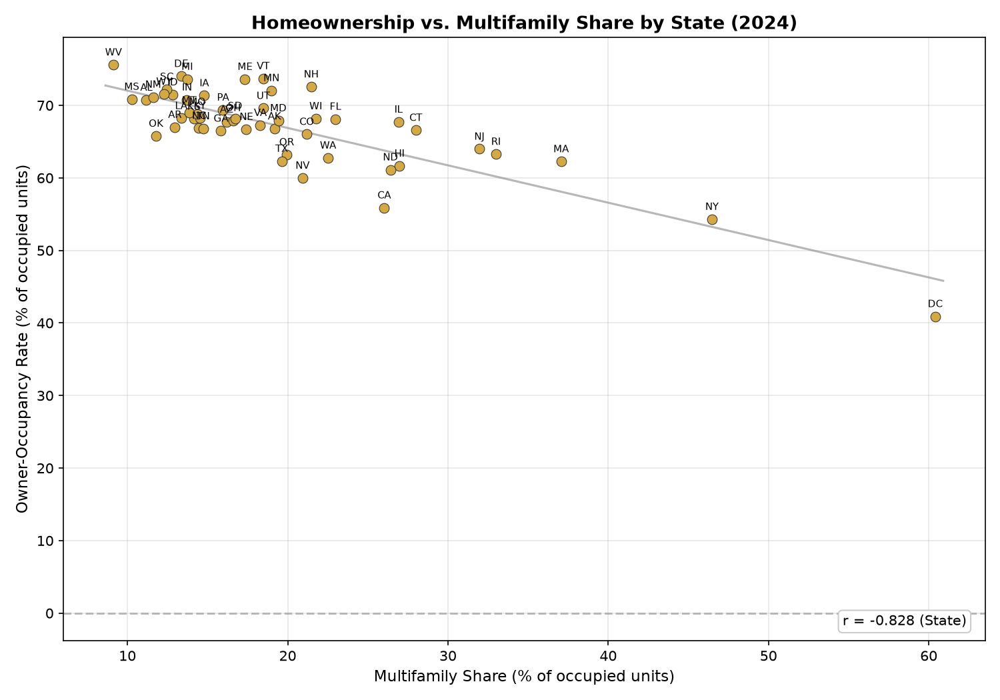

# HPOP Results — 2024 ACS PUMS

## National Summary

| Metric | Ours | Minneapolis Fed | Delta |
|--------|------|-----------------|-------|
| HPOP | 55.9% | 53.1% | +2.8 pp |
| Owner-Occ | 67.1% | 65.3% | +1.8 pp |
| Gap (Owner-Occ − HPOP) | -11.1 pp | — | — |
| Rent-to-Income Ratio | 0.457 | — | — |

## State-Level Results

| State | HPOP | HPOP (MFED) | Δ HPOP | Owner-Occ | OwnOcc (MFED) | Δ OwnOcc | Gap | Rent/Income |
|-------|------|-------------|--------|-----------|---------------|----------|-----|-------------|
| WY | 65.7 | 65.7 | +0.0 | 71.6 | 71.6 | -0.0 | -5.8 | 0.36 |
| ME | 65.1 | 65.1 | -0.0 | 73.6 | 73.6 | +0.0 | -8.5 | 0.45 |
| VT | 64.3 | 64.3 | +0.0 | 73.7 | 73.8 | -0.1 | -9.4 | 0.41 |
| WV | 63.5 | 63.5 | -0.0 | 75.6 | 75.6 | -0.0 | -12.1 | 0.42 |
| IA | 63.2 | 63.2 | +0.0 | 71.4 | 71.4 | -0.0 | -8.1 | 0.40 |
| MN | 63.2 | 63.2 | -0.0 | 72.1 | 72.1 | -0.0 | -8.9 | 0.43 |
| SD | 62.2 | 62.2 | -0.0 | 68.2 | 68.2 | +0.0 | -6.0 | 0.36 |
| MI | 61.2 | 61.2 | -0.0 | 73.6 | 73.6 | +0.0 | -12.4 | 0.46 |
| WI | 60.9 | 60.9 | -0.0 | 68.2 | 68.2 | -0.0 | -7.3 | 0.41 |
| NE | 60.5 | 60.5 | +0.0 | 66.7 | 66.7 | +0.0 | -6.2 | 0.41 |
| SC | 60.3 | 60.3 | -0.0 | 72.2 | 72.2 | +0.0 | -11.9 | 0.49 |
| IN | 60.1 | 60.1 | +0.0 | 70.8 | 70.8 | -0.0 | -10.7 | 0.43 |
| NH | 59.8 | 59.8 | -0.0 | 72.6 | 72.6 | -0.0 | -12.8 | 0.46 |
| KS | 59.6 | 59.6 | +0.0 | 68.1 | 68.1 | +0.0 | -8.5 | 0.39 |
| MO | 59.2 | 59.2 | +0.0 | 68.8 | 68.8 | -0.0 | -9.5 | 0.41 |
| ID | 59.0 | 59.0 | +0.0 | 71.5 | 71.5 | -0.0 | -12.4 | 0.50 |
| DE | 59.0 | 59.0 | -0.0 | 74.0 | 74.0 | +0.0 | -15.0 | 0.50 |
| MT | 58.8 | 58.8 | +0.0 | 69.0 | 69.0 | -0.0 | -10.1 | 0.42 |
| OH | 58.6 | 58.6 | +0.0 | 67.9 | 67.9 | +0.0 | -9.3 | 0.43 |
| PA | 58.0 | 58.0 | -0.0 | 69.4 | 69.4 | -0.0 | -11.4 | 0.43 |
| KY | 57.9 | 57.9 | +0.0 | 68.2 | 68.2 | +0.0 | -10.3 | 0.42 |
| AL | 57.8 | 57.8 | +0.0 | 70.7 | 70.7 | +0.0 | -12.9 | 0.45 |
| MS | 57.5 | 57.5 | -0.0 | 70.9 | 70.9 | -0.0 | -13.4 | 0.44 |
| ND | 57.3 | 57.3 | -0.0 | 61.1 | 61.2 | -0.1 | -3.8 | 0.33 |
| CO | 57.2 | 57.2 | -0.0 | 66.0 | 66.0 | +0.0 | -8.8 | 0.49 |
| AR | 57.1 | 57.1 | -0.0 | 67.0 | 67.0 | +0.0 | -9.9 | 0.43 |
| NC | 56.7 | 56.7 | -0.0 | 66.9 | 66.9 | -0.0 | -10.2 | 0.45 |
| TN | 56.4 | 56.4 | +0.0 | 66.8 | 66.8 | -0.0 | -10.4 | 0.46 |
| LA | 56.4 | 56.4 | -0.0 | 68.2 | 68.2 | +0.0 | -11.8 | 0.46 |
| NM | 56.2 | 56.2 | -0.0 | 71.2 | 71.2 | -0.0 | -15.0 | 0.42 |
| IL | 56.0 | 56.0 | -0.0 | 67.7 | 67.7 | +0.0 | -11.8 | 0.44 |
| UT | 55.0 | 55.0 | -0.0 | 69.6 | 69.6 | -0.0 | -14.6 | 0.52 |
| VA | 54.8 | 54.8 | -0.0 | 67.3 | 67.3 | -0.0 | -12.5 | 0.47 |
| OK | 54.7 | 54.7 | +0.0 | 65.8 | 65.8 | -0.0 | -11.0 | 0.42 |
| AZ | 54.7 | 54.7 | -0.0 | 67.7 | 67.7 | +0.0 | -13.1 | 0.51 |
| CT | 54.0 | 54.0 | -0.0 | 66.6 | 66.6 | -0.0 | -12.6 | 0.48 |
| AK | 54.0 | 54.0 | -0.0 | 66.8 | 66.8 | -0.0 | -12.8 | 0.44 |
| MD | 53.7 | 53.7 | +0.0 | 67.9 | 67.9 | -0.0 | -14.2 | 0.49 |
| FL | 53.3 | 53.3 | -0.0 | 68.1 | 68.1 | +0.0 | -14.8 | 0.61 |
| OR | 53.1 | 53.1 | -0.0 | 63.2 | 63.2 | +0.0 | -10.1 | 0.51 |
| WA | 52.9 | 52.9 | -0.0 | 62.8 | 62.8 | -0.0 | -9.9 | 0.46 |
| GA | 52.8 | 52.8 | -0.0 | 66.5 | 66.5 | -0.0 | -13.7 | 0.50 |
| RI | 51.1 | 51.1 | +0.0 | 63.3 | 63.3 | -0.0 | -12.1 | 0.48 |
| NJ | 50.5 | 50.5 | +0.0 | 64.0 | 64.0 | -0.0 | -13.4 | 0.52 |
| MA | 50.4 | 50.4 | -0.0 | 62.3 | 62.3 | -0.0 | -11.9 | 0.50 |
| TX | 50.2 | 50.2 | +0.0 | 62.3 | 62.3 | +0.0 | -12.1 | 0.48 |
| NV | 46.4 | 46.4 | -0.0 | 60.0 | 60.0 | -0.0 | -13.6 | 0.57 |
| NY | 43.3 | 43.3 | -0.0 | 54.3 | 54.3 | +0.0 | -11.1 | 0.47 |
| HI | 42.7 | 42.7 | +0.0 | 61.7 | 61.6 | +0.1 | -18.9 | 0.56 |
| CA | 41.2 | 41.2 | -0.0 | 55.9 | 55.9 | -0.0 | -14.7 | 0.58 |
| DC | 34.6 | 34.6 | +0.0 | 40.9 | 40.9 | +0.0 | -6.3 | 0.40 |

## Validation vs Minneapolis Fed

| Metric | Correlation (r) | MAE (pp) | Mean Bias |
|--------|-----------------|----------|-----------|
| HPOP | 1.0000 | 0.03 | -0.01 |
| Owner-Occ | 1.0000 | 0.03 | -0.01 |

## Correlations vs Gap (neg_gap)

| Variable | r vs Neg-Gap |
|----------|--------------|
| Rent-to-Income | 0.774 |
| Adults per Unit | 0.863 |

### Rent-to-Income vs Gap

Correlation with gap: r = 0.774

### Multifamily Share vs Occupancy Rate

### Adults per Home vs Gap

Correlation with gap: r = 0.863

### Rent-to-Income vs Adults per Home

Rent-to-income and adults per unit are correlated at the state level (r = 0.848), confirming the ecological confound: expensive states also have larger households.

## Key Findings

1. **HPOP < Owner-Occ everywhere** — traditional owner-occupancy rate almost always overstates
   effective homeownership because it counts cohabitants (adult children, roommates)
   in owner-occupied units as owners.

2. **Gap varies by state** — ranges from -18.9 pp (ND) to -3.8 pp (HI), driven by
   housing costs, household composition, and prevalence of adult co-residents.

3. **Rent burden is the strongest correlate** of the gap (r = 0.774), suggesting that
   housing affordability drives the divergence between owner-occ and HPOP.

4. **Adults per home is also strongly correlated** with the gap (r = 0.863), 
   meaning states with larger households show a bigger gap between the two homeownership measures.

5. **Multifamily share vs gap at state level** (r = -0.075) — the relationship is 
   weaker across states than within metros, suggesting other state-level factors
   (household composition, costs) dominate.
