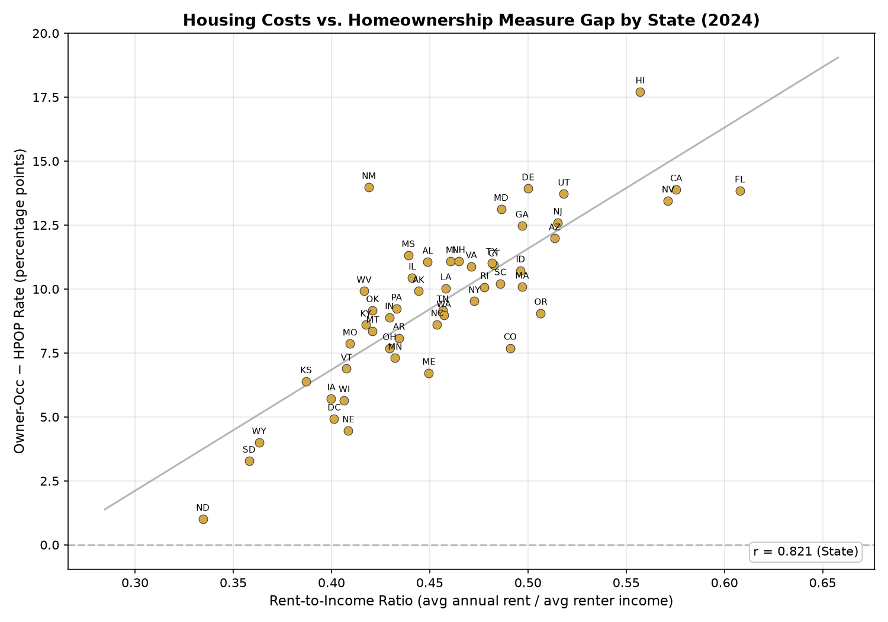
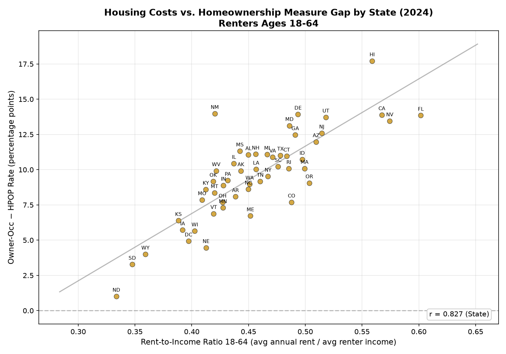
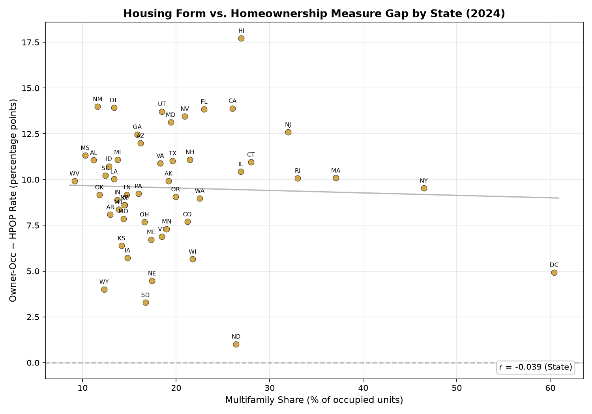
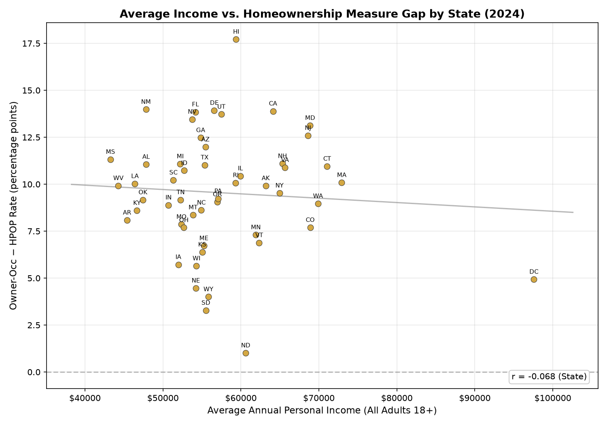
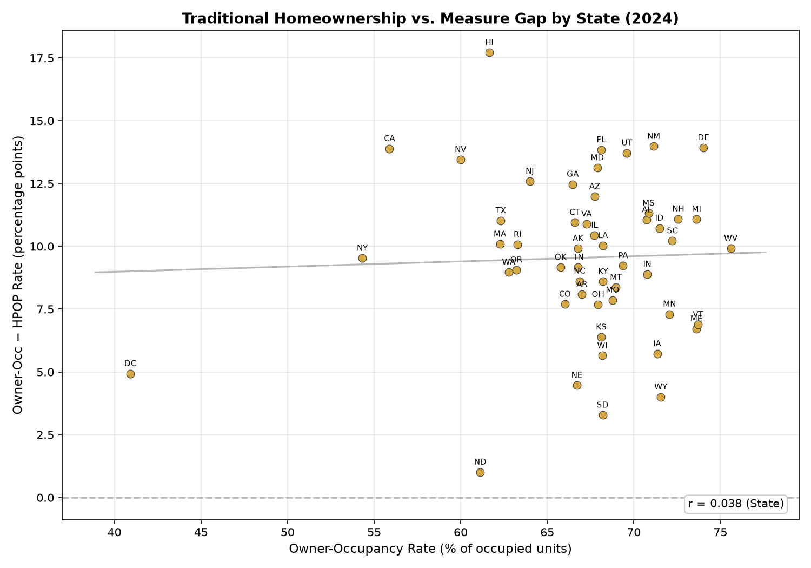

# HPOP Results — 2024 ACS PUMS

## National Summary

| Metric | Ours | Minneapolis Fed | Delta |
|--------|------|-----------------|-------|
| HPOP | 57.5% | 53.1% | +4.4 pp |
| Owner-Occ | 67.1% | 65.3% | +1.8 pp |
| Gap (Owner-Occ − HPOP) | -9.5 pp | — | — |
| Rent-to-Income Ratio | 0.457 | — | — |
| Rent-to-Income 18-64 | 0.456 | — | — |
| Avg Adult Income | $57,459 | — | — |
| Price-to-Income Ratio | 5.9 | — | — |

## State-Level Results

| State | HPOP | HPOP (MFED) | Δ HPOP | Owner-Occ | OwnOcc (MFED) | Δ OwnOcc | Gap | Rent/Income | Price/Income |
|-------|------|-------------|--------|-----------|---------------|----------|-----|-------------|--------------|
| WY | 67.6 | 65.7 | +1.9 | 71.6 | 71.6 | -0.0 | -4.0 | 0.36 | 7.3 |
| ME | 66.9 | 65.1 | +1.8 | 73.6 | 73.6 | +0.0 | -6.7 | 0.45 | 6.2 |
| VT | 66.8 | 64.3 | +2.5 | 73.7 | 73.8 | -0.1 | -6.9 | 0.41 | 5.6 |
| WV | 65.7 | 63.5 | +2.2 | 75.6 | 75.6 | -0.0 | -9.9 | 0.42 | 4.1 |
| IA | 65.6 | 63.2 | +2.4 | 71.4 | 71.4 | -0.0 | -5.7 | 0.40 | 4.3 |
| SD | 64.9 | 62.2 | +2.7 | 68.2 | 68.2 | +0.0 | -3.3 | 0.36 | 4.8 |
| MN | 64.8 | 63.2 | +1.6 | 72.1 | 72.1 | -0.0 | -7.3 | 0.43 | 5.1 |
| MI | 62.5 | 61.2 | +1.3 | 73.6 | 73.6 | +0.0 | -11.1 | 0.46 | 4.6 |
| WI | 62.5 | 60.9 | +1.6 | 68.2 | 68.2 | -0.0 | -5.6 | 0.41 | 5.1 |
| NE | 62.2 | 60.5 | +1.7 | 66.7 | 66.7 | +0.0 | -4.5 | 0.41 | 4.5 |
| SC | 62.0 | 60.3 | +1.7 | 72.2 | 72.2 | +0.0 | -10.2 | 0.49 | 6.1 |
| IN | 61.9 | 60.1 | +1.8 | 70.8 | 70.8 | -0.0 | -8.9 | 0.43 | 4.5 |
| KS | 61.7 | 59.6 | +2.1 | 68.1 | 68.1 | +0.0 | -6.4 | 0.39 | 4.1 |
| NH | 61.5 | 59.8 | +1.7 | 72.6 | 72.6 | -0.0 | -11.1 | 0.46 | 6.3 |
| MO | 60.9 | 59.2 | +1.7 | 68.8 | 68.8 | -0.0 | -7.9 | 0.41 | 4.5 |
| ID | 60.8 | 59.0 | +1.8 | 71.5 | 71.5 | -0.0 | -10.7 | 0.50 | 7.8 |
| MT | 60.6 | 58.8 | +1.8 | 69.0 | 69.0 | -0.0 | -8.4 | 0.42 | 8.2 |
| OH | 60.2 | 58.6 | +1.6 | 67.9 | 67.9 | +0.0 | -7.7 | 0.43 | 4.2 |
| PA | 60.1 | 58.0 | +2.1 | 69.4 | 69.4 | -0.0 | -9.2 | 0.43 | 4.7 |
| ND | 60.1 | 57.3 | +2.8 | 61.1 | 61.2 | -0.1 | -1.0 | 0.33 | 4.0 |
| DE | 60.1 | 59.0 | +1.1 | 74.0 | 74.0 | +0.0 | -13.9 | 0.50 | 5.8 |
| AL | 59.7 | 57.8 | +1.9 | 70.7 | 70.7 | +0.0 | -11.1 | 0.45 | 4.6 |
| KY | 59.6 | 57.9 | +1.7 | 68.2 | 68.2 | +0.0 | -8.6 | 0.42 | 4.5 |
| MS | 59.5 | 57.5 | +2.0 | 70.9 | 70.9 | -0.0 | -11.3 | 0.44 | 4.2 |
| AR | 58.9 | 57.1 | +1.8 | 67.0 | 67.0 | +0.0 | -8.1 | 0.43 | 4.3 |
| CO | 58.3 | 57.2 | +1.1 | 66.0 | 66.0 | +0.0 | -7.7 | 0.49 | 7.6 |
| NC | 58.2 | 56.7 | +1.5 | 66.9 | 66.9 | -0.0 | -8.6 | 0.45 | 5.7 |
| LA | 58.2 | 56.4 | +1.8 | 68.2 | 68.2 | +0.0 | -10.0 | 0.46 | 4.3 |
| TN | 57.6 | 56.4 | +1.2 | 66.8 | 66.8 | -0.0 | -9.2 | 0.46 | 6.0 |
| IL | 57.3 | 56.0 | +1.3 | 67.7 | 67.7 | +0.0 | -10.4 | 0.44 | 4.4 |
| NM | 57.2 | 56.2 | +1.0 | 71.2 | 71.2 | -0.0 | -14.0 | 0.42 | 5.4 |
| AK | 56.9 | 54.0 | +2.9 | 66.8 | 66.8 | -0.0 | -9.9 | 0.44 | 5.2 |
| OK | 56.6 | 54.7 | +1.9 | 65.8 | 65.8 | -0.0 | -9.2 | 0.42 | 4.3 |
| VA | 56.4 | 54.8 | +1.6 | 67.3 | 67.3 | -0.0 | -10.9 | 0.47 | 5.9 |
| UT | 55.9 | 55.0 | +0.9 | 69.6 | 69.6 | -0.0 | -13.7 | 0.52 | 7.7 |
| AZ | 55.8 | 54.7 | +1.1 | 67.7 | 67.7 | +0.0 | -12.0 | 0.51 | 6.9 |
| CT | 55.6 | 54.0 | +1.6 | 66.6 | 66.6 | -0.0 | -11.0 | 0.48 | 5.8 |
| MD | 54.8 | 53.7 | +1.1 | 67.9 | 67.9 | -0.0 | -13.1 | 0.49 | 5.6 |
| FL | 54.3 | 53.3 | +1.0 | 68.1 | 68.1 | +0.0 | -13.8 | 0.61 | 7.2 |
| OR | 54.1 | 53.1 | +1.0 | 63.2 | 63.2 | +0.0 | -9.1 | 0.51 | 7.5 |
| GA | 54.0 | 52.8 | +1.2 | 66.5 | 66.5 | -0.0 | -12.5 | 0.50 | 5.5 |
| WA | 53.8 | 52.9 | +0.9 | 62.8 | 62.8 | -0.0 | -9.0 | 0.46 | 7.9 |
| RI | 53.2 | 51.1 | +2.1 | 63.3 | 63.3 | -0.0 | -10.1 | 0.48 | 6.6 |
| MA | 52.2 | 50.4 | +1.8 | 62.3 | 62.3 | -0.0 | -10.1 | 0.50 | 7.2 |
| NJ | 51.4 | 50.5 | +0.9 | 64.0 | 64.0 | -0.0 | -12.6 | 0.52 | 6.1 |
| TX | 51.3 | 50.2 | +1.1 | 62.3 | 62.3 | +0.0 | -11.0 | 0.48 | 5.0 |
| NV | 46.5 | 46.4 | +0.1 | 60.0 | 60.0 | -0.0 | -13.5 | 0.57 | 7.2 |
| NY | 44.8 | 43.3 | +1.5 | 54.3 | 54.3 | +0.0 | -9.5 | 0.47 | 6.9 |
| HI | 43.9 | 42.7 | +1.2 | 61.7 | 61.6 | +0.1 | -17.7 | 0.56 | 13.0 |
| CA | 42.0 | 41.2 | +0.8 | 55.9 | 55.9 | -0.0 | -13.9 | 0.58 | 10.2 |
| DC | 36.0 | 34.6 | +1.4 | 40.9 | 40.9 | +0.0 | -4.9 | 0.40 | 6.5 |

## Validation vs Minneapolis Fed

| Metric | Correlation (r) | MAE (pp) | Mean Bias |
|--------|-----------------|----------|-----------|
| HPOP | 0.9972 | 1.60 | +1.60 |
| Owner-Occ | 1.0000 | 0.03 | -0.01 |

## Gap Correlations

| Variable | r vs Neg-Gap |
|----------|--------------|
| Rent-to-Income (renter 18+) | 0.821 |
| Rent-to-Income (renter 18-64) | 0.827 |
| Price-to-Income (owner) | 0.465 |
| Multifamily Share | -0.039 |
| Avg Adult Income | -0.068 |
| Owner-Occ Rate | 0.038 |

## Rent-to-Income: All Adults vs Ages 18-64

Correlation with gap (neg-gap): all adults r = 0.821, ages 18-64 r = 0.827

## Housing Form by State

## Average Income vs Gap

Correlation with gap: r = -0.068

## Traditional Homeownership vs Gap

Correlation with gap: r = 0.038

| State | Single-Family | Multifamily | Mobile/Other |
|-------|---------------|-------------|--------------|
| DC | 39.6% | 60.4% | -0.0% |
| NY | 51.7% | 46.5% | 1.8% |
| MA | 62.2% | 37.1% | 0.7% |
| RI | 66.4% | 33.0% | 0.6% |
| NJ | 67.3% | 32.0% | 0.8% |
| CT | 71.4% | 28.0% | 0.6% |
| HI | 73.0% | 27.0% | 0.1% |
| IL | 71.2% | 26.9% | 1.9% |
| ND | 68.0% | 26.4% | 5.6% |
| CA | 70.8% | 26.0% | 3.2% |
| FL | 70.3% | 23.0% | 6.8% |
| WA | 71.8% | 22.5% | 5.7% |
| WI | 75.9% | 21.7% | 2.4% |
| NH | 74.0% | 21.5% | 4.6% |
| CO | 75.5% | 21.2% | 3.3% |
| NV | 74.1% | 20.9% | 5.0% |
| OR | 73.2% | 19.9% | 6.8% |
| TX | 73.9% | 19.6% | 6.5% |
| MD | 79.4% | 19.4% | 1.2% |
| AK | 77.2% | 19.2% | 3.6% |
| MN | 78.6% | 19.0% | 2.4% |
| UT | 78.9% | 18.5% | 2.6% |
| VT | 74.7% | 18.5% | 6.8% |
| VA | 77.9% | 18.3% | 3.8% |
| NE | 80.2% | 17.4% | 2.4% |
| ME | 74.2% | 17.3% | 8.5% |
| SD | 76.5% | 16.7% | 6.7% |
| OH | 80.4% | 16.6% | 3.0% |
| AZ | 75.8% | 16.2% | 8.1% |
| PA | 81.0% | 16.0% | 3.1% |
| GA | 76.9% | 15.8% | 7.2% |
| IA | 82.2% | 14.8% | 3.1% |
| TN | 77.5% | 14.7% | 7.8% |
| KY | 75.6% | 14.5% | 9.9% |
| NC | 75.3% | 14.5% | 10.2% |
| MO | 80.8% | 14.4% | 4.8% |
| KS | 82.4% | 14.2% | 3.4% |
| MT | 76.8% | 13.9% | 9.3% |
| MI | 81.8% | 13.7% | 4.5% |
| IN | 82.6% | 13.7% | 3.6% |
| DE | 80.2% | 13.4% | 6.5% |
| LA | 75.3% | 13.3% | 11.4% |
| AR | 76.9% | 13.0% | 10.1% |
| ID | 80.7% | 12.8% | 6.5% |
| SC | 74.9% | 12.4% | 12.6% |
| WY | 76.2% | 12.3% | 11.5% |
| OK | 80.4% | 11.8% | 7.8% |
| NM | 71.7% | 11.6% | 16.7% |
| AL | 77.4% | 11.2% | 11.4% |
| MS | 75.9% | 10.3% | 13.8% |
| WV | 78.6% | 9.1% | 12.2% |

## Key Findings

1. **HPOP < Owner-Occ everywhere** — traditional owner-occupancy rate always overstates
   effective homeownership because it counts cohabitants (adult children, roommates)
   in owner-occupied units as owners.

2. **Gap varies by state** — ranges from -1.0 pp (ND) to -17.7 pp (HI), driven by
   housing costs, household composition, and prevalence of adult co-residents.

3. **Rent burden is the strongest correlate** of the gap (r = 0.821), suggesting that
   housing affordability drives the divergence between owner-occ and HPOP.

4. **Multifamily share vs gap at state level** (r = -0.039) — the relationship is 
   weaker across states than within metros (MS PUMAs r = -0.185, NYC PUMAs r = -0.834),
   suggesting other state-level factors (household composition, costs) dominate.